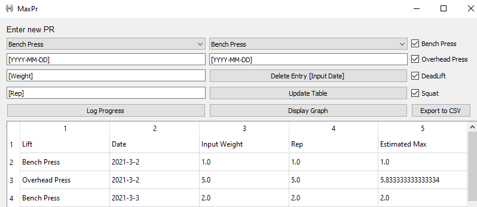
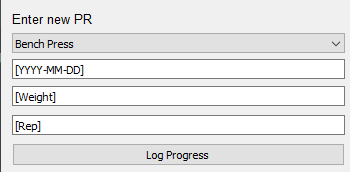
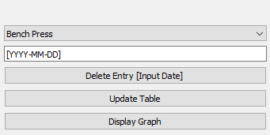
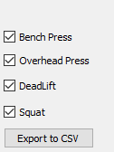
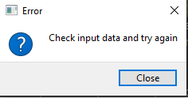

# MaxPy
Built using Python and Sqlite, this program is a simple fitness tracker that allows you to update your daily lift weight/repetition in order to see progression and reach your goals! It uses PyQt5 for the front end and data is stored to your local computer via Sqlite.

#### Prerequisites
The following items are needed to get started:

Pyqt5 - https://pypi.org/project/PyQt5/

Sqlite - https://www.sqlitetutorial.net/download-install-sqlite/

#### Instructions

The top left side of this project allows you to you input your data. 
1. Select a lift from the dropdown box
2. Enter a date in a YYYY-MM-DD format
3. Enter the total weight
4. Enter the Rep
5. Click Log Progress

The middle section is to delete items and to view progress
* Select a lift from the dropdownbox
Options:
* Delete Entry - Enter a date associated with the selected lift above to be deleted 
* Update Table - Update the table in the app to the selected lift by the most recent entries
* Display Graph - Display a chart that shows progression over time by max volume of the selected lift
          
         

This section is used to export the selected checkbox items into a CSV
* Select the lift(s) that needs to be export
* Click Export to get the results
Note: This will overwrite the current csv if there is one.

Note that if data is invalid (the date is in an invalid format or the weight/rep is not a correct numeric value, an error will occur)

#### Improvements/Future Work:

Improve code quality;

Update Lift so that duplicate will update rather than add;

Allow for user import option;

Allow for mass delete;

Allow for user to input their own lifts rather than the pre defined options.

